# Asynchronous FIFO with Clock Domain Crossing (CDC) Reliability Analyzer

> **RTL Design & Verification Project** | Verilog | Xilinx Vivado | Artix-7 `xc7a35ticsg324-1L`  
> Built entirely from scratch — no Xilinx IP cores used  
> Developed as a self-directed study in digital design methodology for graduate-level VLSI applications

---

## Table of Contents

1. [Project Overview](#1-project-overview)
2. [Problem Statement](#2-problem-statement)
3. [Why This Is Difficult](#3-why-this-is-difficult)
4. [Architecture](#4-architecture)
5. [Module Breakdown](#5-module-breakdown)
6. [CDC Methodology](#6-cdc-methodology)
7. [Verification Strategy](#7-verification-strategy)
8. [Simulation Results](#8-simulation-results)
9. [Synthesis Results](#9-synthesis-results)
10. [Timing Analysis](#10-timing-analysis)
11. [Synthesized Schematic Evidence](#11-synthesized-schematic-evidence)
12. [Key Design Decisions](#12-key-design-decisions)
13. [Future Work](#13-future-work)
14. [File Structure](#14-file-structure)
15. [How to Reproduce](#15-how-to-reproduce)

---

## 1. Project Overview

Modern SoC designs routinely contain dozens to hundreds of asynchronous clock domain crossings (CDCs). Each one is a potential point of silent failure — data corruption that no timing analysis tool will flag, no simulation will catch by default, and no logic analyzer will reveal until the chip is already in silicon.

This project designs, verifies, and synthesizes a **parameterized 8-entry × 8-bit Asynchronous FIFO** from first principles, combined with a **CDC Stress Analyzer** testbench that actively probes the design under worst-case asynchronous conditions.

**What was built:**

- 5-module RTL hierarchy in synthesizable Verilog — zero IP cores
- Gray-code pointer arithmetic for safe multi-bit CDC transfer
- Dual flip-flop (2-FF) synchronizers — verified at gate level in synthesized schematic
- Self-checking testbench: deterministic correctness tests + randomized CDC stress
- CDC timing constraints using `set_clock_groups -asynchronous`
- Full synthesis and timing closure on physical Artix-7 target

**The goal is not just a working FIFO.** The goal is to understand *why* each design decision exists — because that understanding is what separates engineers who can debug CDC failures in silicon from engineers who cannot.

---

## 2. Problem Statement

Consider a CPU interface running at 100 MHz writing sensor data to a block running at 37 MHz. Both clocks come from independent PLLs — they share no phase relationship and their frequency ratio drifts continuously.

A naive dual-port RAM would corrupt data. An incorrect synchronizer implementation would corrupt data intermittently — a failure mode that may not appear in simulation, may not appear in functional testing, but will appear in production silicon under temperature, voltage, or process variation.

**The challenge:** Design a FIFO that reliably transfers data between two completely independent clock domains, with correct full/empty flag behavior, zero data corruption under randomized stress, and timing closure on a real FPGA target.

**Constraints imposed on this design:**

- No Xilinx FIFO Generator IP
- Both clocks must be truly asynchronous — no common source, non-integer ratio
- Full and empty flags must be glitch-free under simultaneous read/write pressure
- Design must synthesize with zero timing violations
- Verification must catch both functional errors and boundary condition failures

---

## 3. Why This Is Difficult

### The binary counter problem

When a binary write pointer increments from 7 to 8:

```
Binary:  0111 → 1000   ← all 4 bits change simultaneously
```

If the read-side clock samples this transition at any intermediate point, it may capture `0000`, `1111`, `1010`, `0110` — values that never legitimately existed. This is **metastability**, and it causes false FULL/EMPTY assertions that corrupt data silently.

Standard timing analysis does not catch this. The setup/hold violation happens at the synchronizer input, which is intentionally not timed.

### Why timing closure does not equal CDC correctness

This is the most important insight in CDC design:

> A design can pass all timing checks and still fail due to CDC metastability.  
> The correct solution is architectural, not timing-based.

Correct CDC design requires architectural discipline (Gray code + synchronizers) combined with correct constraint declaration (`set_clock_groups -asynchronous`). The constraints tell the tool: these paths are intentionally untimed — the synchronizer handles resolution.

---

## 4. Architecture

```
         Write Clock Domain (wr_clk)              Read Clock Domain (rd_clk)
        ┌────────────────────────────┐            ┌────────────────────────────┐
        │                            │            │                            │
wr_clk ─▶  wr_ptr_ctrl               │            │  rd_ptr_ctrl       ◀─ rd_clk
        │  Binary counter (4-bit)    │            │  Binary counter (4-bit)    │
        │  Gray encoder              │            │  Gray encoder              │
        │  FULL detection            │            │  EMPTY detection           │
        │         │                  │            │         │                  │
        │  sync_rd_ptr (2-FF)  ◀─────┼────────────┼──▶ sync_wr_ptr (2-FF)     │
        │  rd_gray into wr_clk       │            │  wr_gray into rd_clk       │
        │                            │            │                            │
        └─────────┬──────────────────┘            └──────────┬─────────────────┘
                  │                                          │
                  └───────────────── fifo_mem ───────────────┘
                                 Dual-port LUT RAM
                                 wr_clk for writes
                                 rd_clk for reads
```

**Fundamental constraint:** The two clock domains share no combinational logic. All inter-domain communication passes exclusively through the 2-FF synchronizers. Verified at gate level in synthesized schematic — 31 cells, 81 nets.

---

## 5. Module Breakdown

| Module | Purpose | Clock Domain |
|--------|---------|-------------|
| `async_fifo_top.v` | Top-level port connections and module wiring | Both |
| `fifo_mem.v` | Dual-port synchronous RAM | wr_clk (write), rd_clk (read) |
| `wr_ptr_ctrl.v` | Binary write pointer, Gray encoding, FULL detection | wr_clk |
| `rd_ptr_ctrl.v` | Binary read pointer, Gray encoding, EMPTY detection | rd_clk |
| `gray_sync.v` | 2-FF metastability synchronizer (instantiated twice) | Destination clock |

### `fifo_mem.v`

```verilog
always @(posedge wr_clk) begin
    if (wr_en) mem[wr_addr] <= wr_data;
end
always @(posedge rd_clk) begin
    rd_data <= mem[rd_addr];
end
```

No clock mixing inside any `always` block. Synthesized as LUT-based distributed RAM.

### `wr_ptr_ctrl.v` — FULL detection

```verilog
assign wr_gray      = (wr_bin >> 1) ^ wr_bin;
assign wr_gray_next = (wr_bin_next >> 1) ^ wr_bin_next;

// FULL: writer exactly one lap ahead of reader
// MSBs inverted (lap indicator), lower bits match
assign full = (wr_gray_next ==
              {~rd_gray_sync[ADDR_WIDTH:ADDR_WIDTH-1],
               rd_gray_sync[ADDR_WIDTH-2:0]});
```

Comparison on `wr_gray_next` blocks the write *before* overflow, not after.

### `rd_ptr_ctrl.v` — EMPTY detection

```verilog
assign rd_gray = (rd_bin >> 1) ^ rd_bin;
assign empty   = (rd_gray == wr_gray_sync);
```

### `gray_sync.v` — 2-FF synchronizer

```verilog
always @(posedge clk or posedge rst) begin
    if (rst) begin
        sync1 <= 0; gray_out <= 0;
    end else begin
        sync1    <= gray_in;   // FF1: may go metastable
        gray_out <= sync1;     // FF2: resolves before use
    end
end
```

---

## 6. CDC Methodology

### Why Gray code

Gray code ensures only one bit changes per pointer increment:

```
Gray transition 7 → 8:  0100 → 1100   ← only MSB changes
```

Even if the receiver samples mid-transition, it sees either the old or new valid value — never an illegal combination.

### Why a 2-FF synchronizer is also required

Gray code eliminates multi-bit incoherence. The 2-FF synchronizer eliminates metastability on the single changing bit. Both are required. Neither alone is sufficient.

### CDC timing constraint

```tcl
create_clock -name wr_clk -period 10 [get_ports wr_clk]
create_clock -name rd_clk -period 14 [get_ports rd_clk]

set_clock_groups -asynchronous \
    -group [get_clocks wr_clk] \
    -group [get_clocks rd_clk]
```

Without `set_clock_groups -asynchronous`, Vivado would flag every CDC path as a timing violation — or worse, optimize away synchronizer stages trying to "fix" them.

---

## 7. Verification Strategy

Three layers, from simple to aggressive:

**Layer 1 — Deterministic:** Write known sequence, read back, compare. CDC latency visible in waveform confirms synchronizer pipeline is active.

**Layer 2 — Functional pass/fail:** Four-phase test covering write, read, fill-to-full, drain-to-empty. Automatic pass/fail verdict from `data_error_count`.

**Layer 3 — CDC stress:** Jittered clocks (`$urandom_range`), randomized `wr_en`/`rd_en`, continuous monitoring of overflow, underflow, and data errors over 240+ ns.

---

## 8. Simulation Results

### Deterministic test — PASS

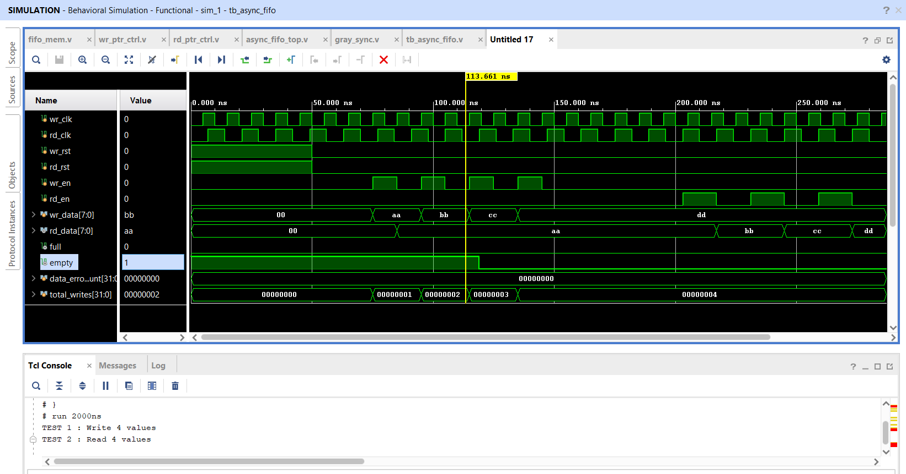

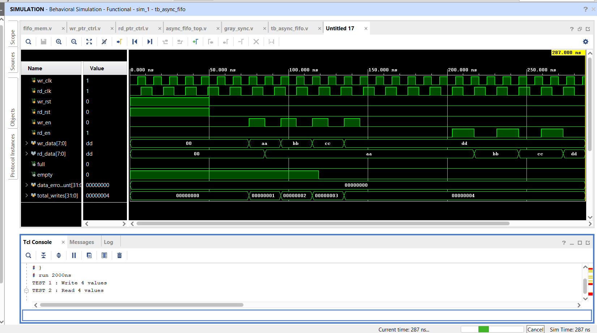

| Signal | Observed |
|--------|---------|
| `wr_data` | 0xAA → 0xBB → 0xCC → 0xDD |
| `rd_data` | 0xAA → 0xBB → 0xCC → 0xDD |
| `data_error_count` | **0x00000000** |
| `total_writes` | 4 |

```
TEST 1 : Write 4 values
TEST 2 : Read 4 values
data_error_count = 00000000
RESULT : PASS
```

### Sequential write verification

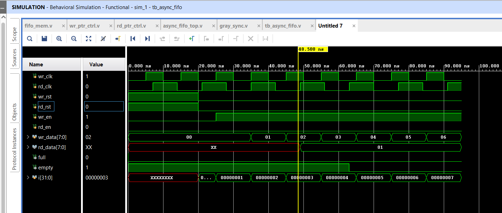

Writes `0x00 → 0x01 → ... → 0x06`. CDC latency clearly visible between `wr_data` and `rd_data` — confirms 2-FF synchronizer pipeline is active and functioning.

### CDC stress test — zero data errors

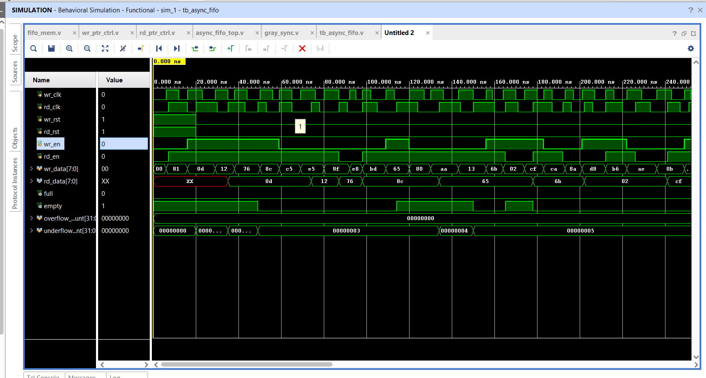

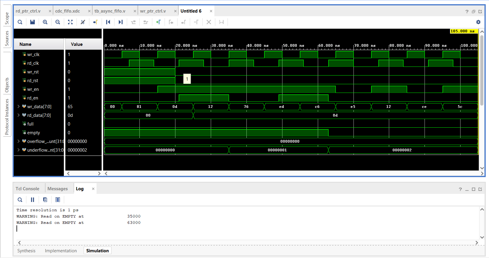

| Metric | Value | Interpretation |
|--------|-------|---------------|
| `overflow_count` | **0** | FULL flag correctly blocked all write-when-full attempts |
| `underflow_count` | 5 | Testbench hit empty FIFO — detected and handled correctly |
| `data_error_count` | **0** | Zero corruption across all random CDC events |

TCL console during stress test:
```
WARNING: Read on EMPTY at    35000
WARNING: Read on EMPTY at    63000
```

These are testbench-generated warnings confirming the empty detection is active — not design errors.

---

## 9. Synthesis Results

**Target:** Artix-7 `xc7a35ticsg324-1L` | Vivado WebPACK (no paid license required)

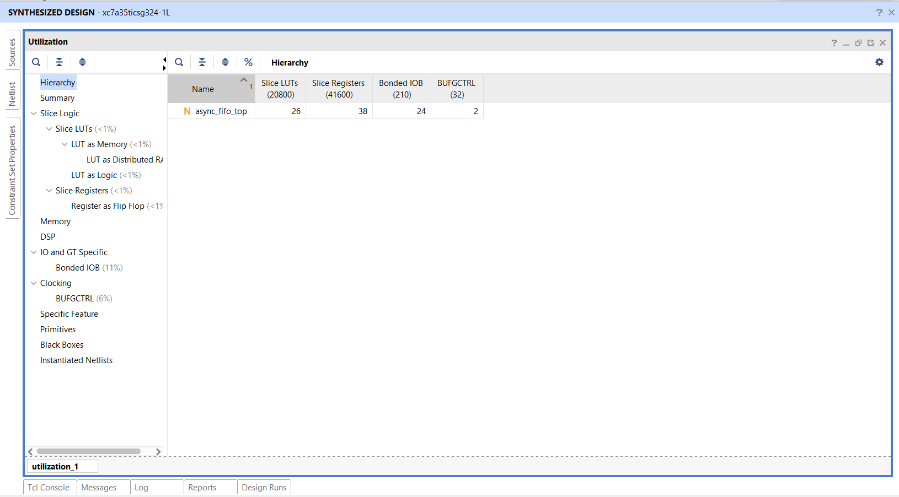

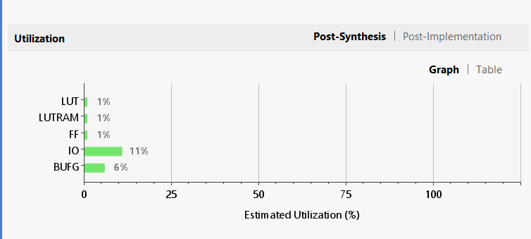

| Resource | Used | Available | Utilization |
|----------|------|-----------|-------------|
| Slice LUTs | **26** | 20,800 | **0.13%** |
| LUT as Memory | included | — | confirmed |
| Slice Registers | **38** | 41,600 | **0.09%** |
| Bonded IOB | 24 | 210 | 11.4% |
| BUFGCTRL | **2** | 32 | **6.25%** |

**BUFGCTRL = 2** directly confirms Vivado inferred two independent global clock trees — one per domain. This is the expected and correct result for an asynchronous dual-clock design.

**LUT as Memory** confirms the FIFO storage is correctly synthesized as distributed RAM, not as flip-flop arrays.

**< 1% LUT and FF utilization** reflects clean RTL — no unintended latches, no redundant logic, no inferred combinational loops.

---

## 10. Timing Analysis

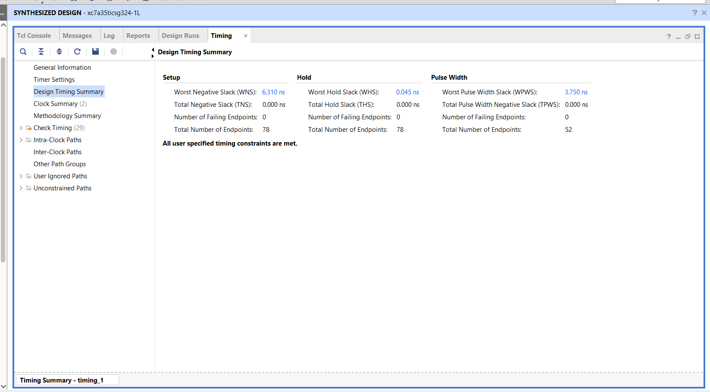

| Metric | Value | Status |
|--------|-------|--------|
| Worst Negative Slack (WNS) | **+6.310 ns** | ✅ |
| Total Negative Slack (TNS) | 0.000 ns | ✅ |
| Worst Hold Slack (WHS) | **+0.045 ns** | ✅ |
| Failing Setup Endpoints | **0 / 78** | ✅ |
| Failing Hold Endpoints | **0 / 78** | ✅ |
| User constraint status | **All constraints met** | ✅ |

WNS = +6.310 ns on a 10 ns clock means the critical path uses only 3.69 ns — 63% timing margin remaining. The design could sustain approximately 270 MHz before timing becomes a concern.

Cross-domain paths are correctly excluded by `set_clock_groups -asynchronous`. The 78 endpoints are all intra-domain — the correct interpretation.

---

## 11. Synthesized Schematic Evidence

### Top-level — 31 cells, 24 I/O ports, 81 nets

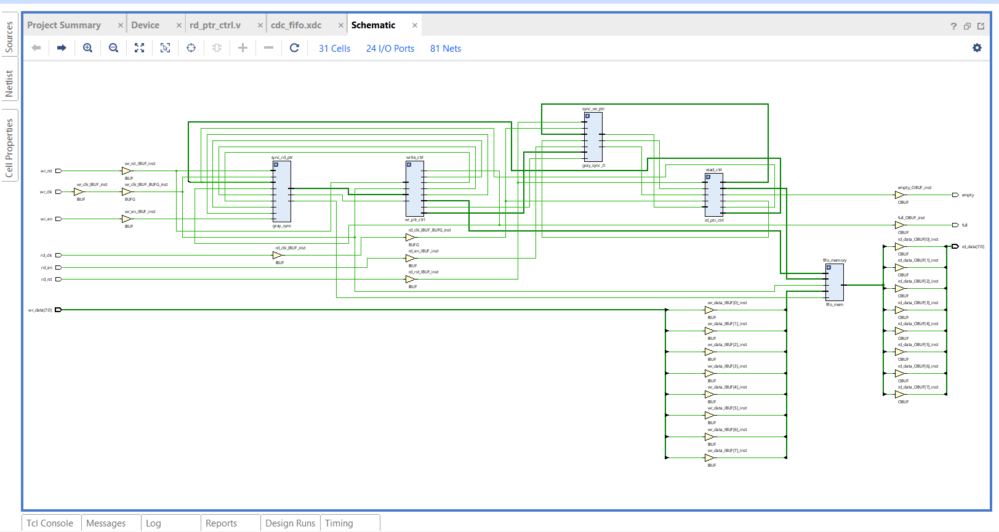

All five submodules present and correctly connected. Two BUFG clock buffers visible — one per clock domain.

### 2-FF synchronizer (write→read) — 15 cells, 27 nets

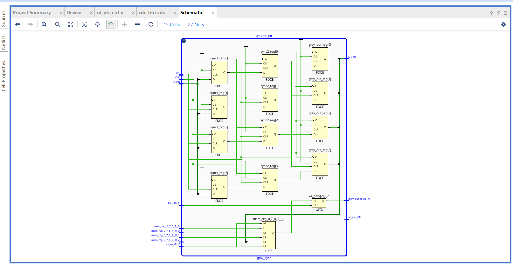

Physical 2-FF chain confirmed as FDCE primitives:
```
gray_in → sync1_reg[0:3] (FDCE) → sync2_reg[0:3] (FDCE) → gray_out_reg[0:3] (FDCE)
```

The synchronizer was not optimized away during synthesis — a failure mode that occurs when CDC constraints are incorrectly applied.

### 2-FF synchronizer (read→write) — 15 cells, 26 nets

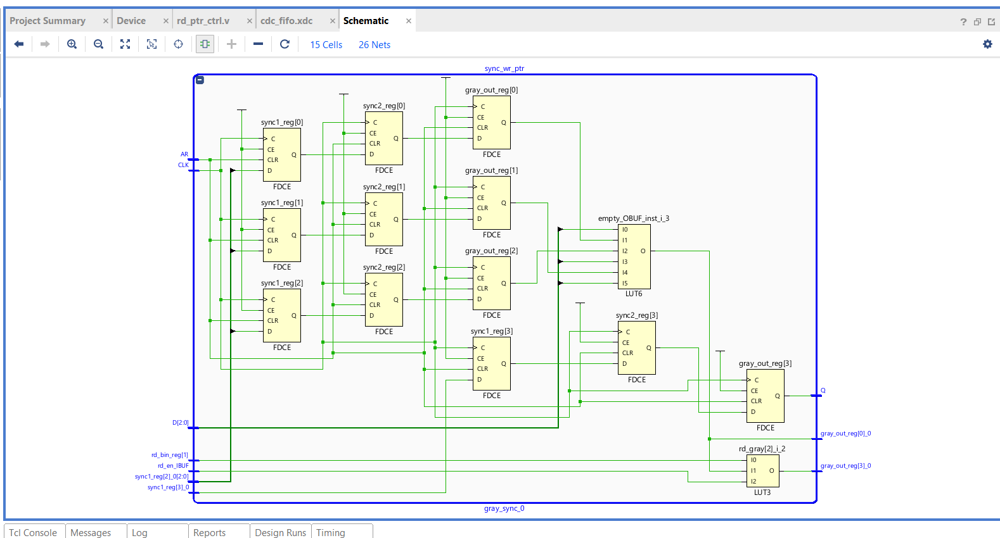

Same 2-FF structure for the opposite direction, with `empty_OBUF` LUT6 for empty flag generation visible at output.

### Read pointer controller — 17 cells, 22 nets

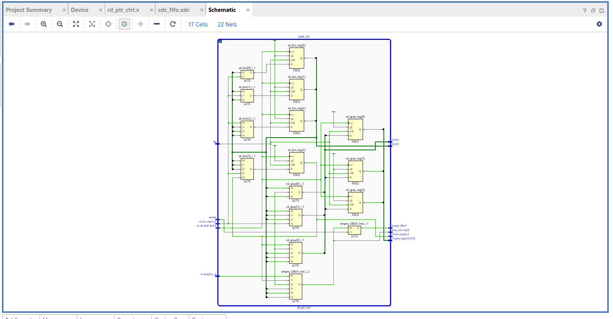

Binary counter FDCEs, Gray encoder LUTs, empty detection logic — all present and correctly connected, matching RTL exactly.

---

## 12. Key Design Decisions

**Why not use Xilinx FIFO Generator IP?**
IP cores abstract the problem. This project was built to understand what the IP is actually doing — and why — because that understanding is necessary to debug CDC failures in real silicon.

**Why Gray code over a 4-phase handshake?**
A 4-phase handshake is CDC-safe but limits throughput to one transfer per 4+ clock edges. Gray-coded pointers deliver near-full burst throughput with conservative flag timing — the standard industry tradeoff for streaming FIFOs.

**Why are flags conservative?**
`full` may assert when one slot is still available. `empty` may assert when one word is in transit. This prevents overflow and underflow at the cost of minor throughput reduction — the correct tradeoff for reliable operation.

**Why check `wr_gray_next` rather than `wr_gray` for FULL?**
Checking the current value detects fullness one cycle late — the write would already have occurred. Checking `wr_gray_next` blocks the write before overflow. This is equivalent to losing one entry of usable depth, which is a known and accepted behavior in Gray-code FIFO design.

---

## 13. Future Work

- **Parameterize depth and width** — Generalize to configurable `DEPTH` and `WIDTH` with automatic Gray code width calculation and BRAM inference for larger depths
- **Formal verification** — Use SymbiYosys to formally prove no-overflow and no-underflow properties
- **AXI4-Stream wrapper** — Add AXI4-Stream slave/master interfaces for direct SoC integration
- **Gate-level simulation** — Run testbench against post-synthesis netlist to verify synthesis correctness
- **Standard-cell synthesis** — Run through OpenLane/Sky130 PDK to estimate ASIC area and power

---

## 14. File Structure

```
Event-Driven-Async-FIFO-CDC/
│
├── README.md
│
├── rtl/
│   ├── async_fifo_top.v        ← Top-level integration
│   ├── fifo_mem.v              ← Dual-port distributed RAM
│   ├── wr_ptr_ctrl.v           ← Write pointer + Gray encoder + FULL
│   ├── rd_ptr_ctrl.v           ← Read pointer + Gray encoder + EMPTY
│   └── gray_sync.v             ← 2-FF metastability synchronizer
│
├── tb/
│   └── cdc_stress_tb.v         ← Self-checking testbench
│
├── constraints/
│   └── cdc_fifo.xdc            ← Async clock groups + period constraints
│
└── docs/
    ├── DESIGN.md
    ├── PROBLEM.md
    ├── results/
    │   ├── synthesis_device_view.png
    │   ├── timing_summary.png
    │   ├── utilization_graph.png
    │   └── utilization_report.png
    ├── schematics/
    │   ├── schematic_gray_sync_rd.png
    │   ├── schematic_gray_sync_wr.png
    │   ├── schematic_rd_ptr_ctrl.png
    │   └── schematic_top.png
    └── waveforms/
        ├── waveform_basic_sim.png
        ├── waveform_basic_sim_2.png
        ├── waveform_cdc_stress.png
        ├── waveform_cdc_stress_2.png
        └── waveform_deterministic.png
```

---

## 15. How to Reproduce

**Requirements:** Xilinx Vivado 2020.x or later, WebPACK edition (free). No FPGA board needed.

```
1. New Project → RTL Project → Part: xc7a35ticsg324-1L

2. Add Design Sources:
   rtl/async_fifo_top.v, fifo_mem.v, wr_ptr_ctrl.v, rd_ptr_ctrl.v, gray_sync.v

3. Add Simulation Source:
   tb/cdc_stress_tb.v

4. Add Constraints:
   constraints/cdc_fifo.xdc

5. Run Simulation → run 2000 ns
   Expected: data_error_count = 0, RESULT: PASS

6. Run Synthesis → Open Synthesized Design
   Expected: WNS = +6.31 ns, 0 failing endpoints
             26 LUTs, 38 FFs, 2 BUFGCTRLs
```

---

## Resume / SOP Statement

> Designed and verified an 8-entry asynchronous FIFO from scratch in Verilog, implementing Gray-code pointer synchronization and dual flip-flop CDC synchronizers for reliable clock domain crossing. Developed a layered verification strategy including deterministic correctness testing and randomized CDC stress simulation with jittered asynchronous clocks, overflow/underflow monitoring, and a golden reference scoreboard. Achieved synthesis timing closure on Xilinx Artix-7 with WNS = +6.31 ns and zero failing timing endpoints across 78 paths. Gate-level synthesized schematic confirmed correct 2-FF synchronizer structure — sync1_reg → sync2_reg → gray_out_reg as physical FDCE primitives.

---

## References

1. Cummings, C.E. — *"Simulation and Synthesis Techniques for Asynchronous FIFO Design"*, SNUG 2002
2. Xilinx UG901 — *Vivado Design Suite User Guide: Synthesis*
3. Xilinx UG949 — *UltraFast Design Methodology Guide* (CDC section)
4. Golson, S. — *"Clock Domain Crossing Design & Verification Techniques"*, Synopsys

---

*Developed by Atharav Todkar as a self-directed hardware engineering project targeting graduate-level digital design competency.*
